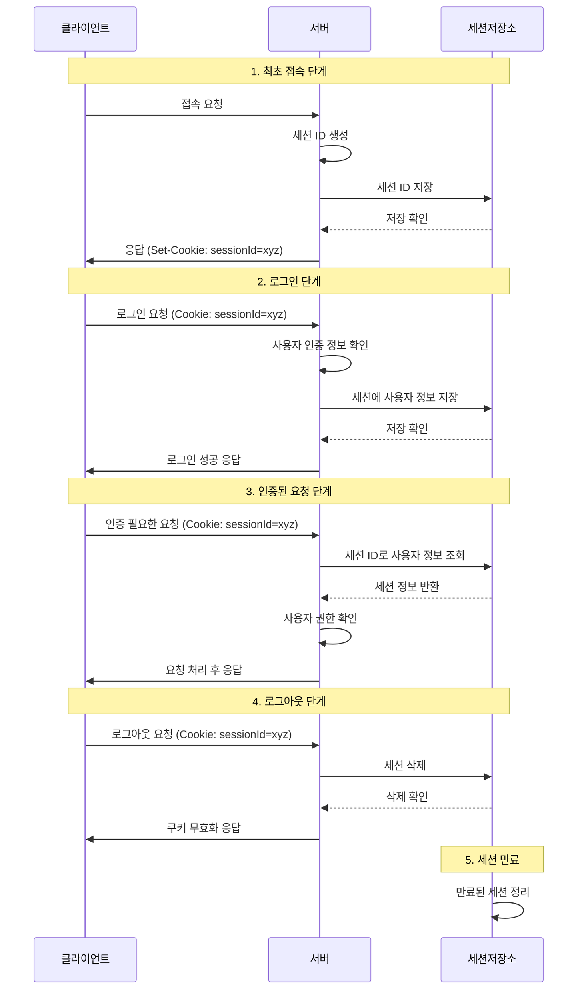

# Session 이란?

세션(Session)은 서버가 클라이언트(사용자)의 상태 정보를 일정 시간 동안 서버 측에 저장하고 유지하는 기술이다. 웹은 기본적으로 무상태(Stateless) 프로토콜인 HTTP를 사용하기 때문에, 각 요청은
독립적이고 이전 요청과의 연관성이 없다. 하지만 실제 웹 애플리케이션에서는 사용자의 로그인 상태나 장바구니 정보 등 상태를 유지할 필요가 있다. 이런 상태 유지를 위해 세션이 사용된다.

## Session의 주요 특징

- 서버 측에 데이터가 저장됨
- 각 사용자마다 고유한 세션 ID가 부여됨
- 세션 ID는 일반적으로 쿠키를 통해 클라이언트에 전달됨
- 일정 시간 동안만 유효(세션 타임아웃)
- 사용자 인증, 상태 유지 등에 활용

## Session과 Cookie의 차이점

세션과 쿠키는 모두 상태 유지를 위한 기술이지만, 다음과 같은 주요 차이점이 있다.

| 구분     | 세션              | 쿠키                   |
|--------|-----------------|----------------------|
| 저장 위치  | 서버              | 클라이언트(브라우저)          |
| 보안     | 상대적으로 안전        | 노출 및 변조 가능성 있음       |
| 용량 제한  | 서버 환경에 따라 다름    | 브라우저마다 다름(일반적으로 4KB) |
| 만료     | 서버에서 관리         | 쿠키 생성 시 설정           |
| 데이터 종류 | 객체를 포함한 다양한 데이터 | 문자열 데이터만 가능          |

# Session의 동작 방식

## Session 생성 및 식별

1. 클라이언트가 서버에 최초로 접속하면, 서버는 해당 클라이언트를 위한 고유한 세션 ID를 생성한다.
2. 서버는 이 세션 ID를 응답 헤더의 `Set-Cookie`를 통해 클라이언트에게 전달한다.
    + `Set-Cookie: JSESSIONID=abcdef12345; Path=/; HttpOnly`
3. 클라이언트(브라우저)는 이 쿠키를 저장하고, 이후 해당 서버로의 모든 요청에 자동으로 포함시킨다.
    + `Cookie: JSESSIONID=abcdef12345`
4. 서버는 요청에 포함된 세션 ID를 통해 해당 클라이언트의 세션 정보를 식별한다.

## Session 데이터 저장 방식

1. **메모리 저장**
    - 서버의 메모리에 직접 저장
    - 빠른 접근 속도가 장점
    - 서버 재시작 시 데이터 손실, 메모리 제한 등이 단점
2. **파일 저장**
    - 서버의 파일 시스템에 세션 데이터 저장
    - 서버 재시작 후에도 데이터 유지 가능
    - 디스크 I/O로 인한 성능 저하 가능성
3. **데이터베이스 저장**
    - RDBMS, NoSQL 등에 세션 데이터 저장
    - 대규모 시스템에 적합, 데이터 지속성 보장
    - 데이터베이스 접근으로 인한 지연 발생 가능
4. **인메모리 데이터베이스 활용**
    - Redis, Memcached 등을 활용
    - 빠른 접근 속도와 데이터 지속성을 모두 확보
    - 다중 서버 환경에서 세션 공유에 적합

## Session 관리

- **세션 갱신**
    - 사용자 활동이 있을 때마다 세션 만료 시간 갱신
    - 세션 데이터 업데이트(장바구니 정보 추가, 사용자 설정 변경 등)
- **세션 만료**
    - 설정된 시간(타임아웃) 동안 사용자 활동이 없으면 세션 만료
    - 브라우저 종료 시 세션 쿠키 삭제(세션 쿠키의 경우)
    - 서버에서 만료된 세션 정리(가비지 컬렉션)
- **세션 삭제**
    - 사용자 로그아웃 시 세션 삭제
    - 보안상 이유로 세션 강제 종료(비밀번호 변경, 의심스러운 활동 등)

# Session 기반 인증 흐름도



### 최초 접속 단계

1. 클라이언트가 서버에 처음 접속한다.
2. 서버는 이 클라이언트를 위한 고유한 세션 ID를 생성한다.
3. 서버는 생성된 세션 ID를 세션 저장소에 저장한다.
4. 서버는 HTTP 응답의 Set-Cookie 헤더를 통해 세션 ID를 클라이언트에게 전달한다.
5. 클라이언트(브라우저)는 이 쿠키를 저장한다.

### 로그인 단계

1. 사용자가 로그인 폼에 인증 정보(아이디/비밀번호)를 입력하고 제출한다.
2. 브라우저는 자동으로 저장된 세션 ID가 담긴 쿠키를 요청에 포함시켜 서버로 전송한다.
3. 서버는 인증 정보를 확인하고, 유효한 경우 해당 세션 ID에 연결된 세션에 사용자 정보를 저장한다.
4. 서버는 로그인 성공 응답을 클라이언트에게 보낸다.

### 인증된 요청 처리 단계

1. 인증 후, 사용자가 보호된 자원에 접근을 시도한다.
2. 브라우저는 저장된 세션 ID가 담긴 쿠키를 자동으로 요청에 포함시켜 서버로 전송한다.
3. 서버는 세션 ID를 사용해 세션 저장소에서 해당 세션을 조회한다.
4. 세션에 사용자 정보가 있으면, 서버는 이 사용자가 인증된 사용자임을 확인한다.
5. 서버는 사용자의 권한을 확인하고, 요청을 처리한 후 응답을 보낸다.

### 로그아웃 단계

1. 사용자가 로그아웃 버튼을 클릭한다.
2. 브라우저는 세션 ID가 담긴 쿠키와 함께 로그아웃 요청을 서버로 보낸다.
3. 서버는 세션 저장소에서 해당 세션을 삭제한다.
4. 서버는 클라이언트의 쿠키를 무효화하는 응답을 보낸다(쿠키 만료 시간을 과거로 설정).
5. 브라우저는 세션 쿠키를 삭제한다.

### 세션 만료 처리

1. 서버는 설정된 타임아웃에 따라 일정 시간 동안 활동이 없는 세션을 만료 처리한다.
2. 만료된 세션은 서버의 메모리나 저장 공간을 확보하기 위해 주기적으로 정리된다.
3. 만료된 세션으로 요청이 오면, 서버는 새로운 세션을 생성하거나 로그인 페이지로 리다이렉트한다.

# 모바일에서의 Session 활용방법

네이티브 모바일 앱에서도 세션 기반 인증을 사용할 수 있지만, 웹 브라우저와는 다른 방식으로 구현해야 한다.

## 네이티브 앱에서의 세션 관리 방법

### 세션 ID 저장

- 앱 내부 저장소에 세션 ID 저장 (Android의 SharedPreferences, iOS의 UserDefaults)
- 보안이 중요한 경우 암호화된 저장소 사용 (Android의 EncryptedSharedPreferences, iOS의 Keychain)

```swift
// iOS 예제 (Swift)
UserDefaults.standard.set("abcdef12345", forKey: "sessionId")
```

```kotlin
// Android 예제 (Kotlin)
val sharedPref = getSharedPreferences("session_prefs", Context.MODE_PRIVATE)
with(sharedPref.edit()) {
    putString("sessionId", "abcdef12345")
    apply()
}
```

### 요청에 Session ID 포함

- HTTP 요청 헤더에 세션 ID 추가
- 쿠키 헤더 또는 커스텀 헤더 사용

```kotlin
// Retrofit/OkHttp를 사용한 Android 예제
val client = OkHttpClient.Builder()
    .addInterceptor { chain ->
        val original = chain.request()
        val sessionId = getSessionId() // 저장된 세션 ID를 가져오는 함수

        val requestWithSession = original.newBuilder()
            .header("Cookie", "JSESSIONID=$sessionId")
            .build()

        chain.proceed(requestWithSession)
    }
    .build()
```

### 세션 갱신 및 만료 처리

- 서버 응답 헤더에서 새로운 세션 ID 확인 및 저장
- 세션 만료 시 로그인 화면으로 이동

## 모바일 환경에서의 세션 활용 한계

- **쿠키 자동 관리 부재**
    - 웹 브라우저와 달리 네이티브 앱은 쿠키를 자동으로 관리하지 않음
    - 개발자가 직접 세션 ID 저장 및 요청 포함 로직 구현 필요
- **앱 종료 후 상태 유지 문제**
    - 앱이 완전히 종료된 후에도 인증 상태를 유지해야 하는 경우 추가 로직 필요
    - 웹의 '자동 로그인' 기능과 유사한 방식 구현 필요
- **다중 서버 환경에서의 세션 공유**
    - 대규모 서비스의 경우 서버 확장성 문제 발생
    - 세션 저장소 관리 부담 증가
- **모바일 네트워크 특성**
    - 불안정한 연결, 높은 지연 시간 등 모바일 네트워크 환경에서 세션 관리 어려움
    - 오프라인 상태에서의 인증 문제

## JWT를 대안으로 사용하는 이유

JWT(JSON Web Token)는 모바일 환경에서 세션의 한계를 극복할 수 있는 대안으로 널리 사용된다.

1. **상태 비저장(Stateless) 아키텍처**
    - 서버가 클라이언트의 상태를 저장할 필요 없음
    - 토큰 자체에 필요한 정보(사용자 ID, 권한 등)가 포함됨
    - 서버 측 세션 저장소 불필요
2. **확장성 향상**
    - 다중 서버 환경에서도 별도의 세션 공유 메커니즘 없이 인증 가능
    - 마이크로서비스 아키텍처에 적합
3. **크로스 플랫폼 일관성**
    - 웹, 모바일 앱 등 다양한 클라이언트에서 동일한 인증 방식 사용 가능
    - 백엔드 API의 일관된 인증 처리 가능
4. **모바일 환경 적합성**
    - 토큰을 저장소에 안전하게 보관하고 요청마다 헤더에 포함시키는 방식이 모바일 앱 아키텍처에 적합
    - 오프라인 상태에서도 토큰의 유효성 검증 가능(만료 시간 체크 등)

# JWT vs Session

| 상황                  | 권장 방식      | 이유                  |
|---------------------|------------|---------------------|
| 단일 서버, 소규모 웹 애플리케이션 | 세션         | 구현 간단, 세션 관리 부담 적음  |
| 대규모, 분산 시스템         | JWT        | 확장성, 서버 간 상태 공유 불필요 |
| 실시간 세션 무효화 중요       | 세션         | 중앙에서 세션 즉시 삭제 가능    |
| 모바일 앱 중심 서비스        | JWT        | 모바일 환경 적합성, 구현 편의성  |
| 매우 민감한 데이터 다룸       | 세션 + 추가 보안 | 세션 ID만으로는 정보 노출 없음  |
| 마이크로서비스 아키텍처        | JWT        | 서비스 간 인증 정보 공유 용이   |

# Session의 단점과 극복방안

### 서버 자원 사용 문제

**단점**:

- 활성 세션이 많을수록 서버 메모리 사용량 증가
- 세션 데이터 크기가 클수록 자원 소모 증가
- 세션 조회, 업데이트에 따른 성능 저하 가능성

**극복 방안**:

1. **세션 데이터 최소화**
    - 필요한 정보만 세션에 저장
    - 대용량 데이터는 데이터베이스에 저장하고 참조 ID만 세션에 유지
2. **효율적인 세션 만료 정책**
    - 적절한 세션 타임아웃 설정
    - 주기적인 세션 정리(가비지 컬렉션) 스케줄링
3. **인메모리 데이터베이스 활용**
    - Redis와 같은 고성능 인메모리 데이터베이스 사용
    - 메모리 사용 최적화 및 빠른 접근 속도 확보

### 다중 서버 환경에서의 세션 공유 문제

**단점**

- 여러 서버가 동일한 세션 정보에 접근해야 함
- 로드 밸런싱 환경에서 사용자 요청이 다른 서버로 라우팅될 수 있음
- 서버 간 세션 불일치 시 사용자 경험 저하(재로그인 요구 등)

**극복 방안**

#### 1. Sticky Session (세션 고정)

로드 밸런서가 특정 사용자의 요청을 항상 동일한 서버로 라우팅하는 방식이다.

**장점**

- 구현이 상대적으로 간단
- 세션 공유 메커니즘 불필요

**단점**

- 특정 서버에 트래픽 집중 가능성
- 서버 장애 시 모든 세션 손실
- 수평 확장 시 효율 저하

#### 2. 중앙 집중식 세션 저장소

모든 서버가 공유하는 중앙 집중식 세션 저장소를 사용하는 방식이다.

**장점**

- 서버 간 세션 일관성 유지
- 서버 장애 시에도 세션 데이터 보존
- 수평 확장 용이

**단점**

- 세션 저장소 접근에 따른 성능 오버헤드
- 세션 저장소 자체가 단일 장애점(SPOF)이 될 수 있음
- 추가 인프라 관리 필요

```java
// Spring Boot + Redis
@Configuration
@EnableRedisHttpSession
public class SessionConfig {

    @Bean
    public LettuceConnectionFactory connectionFactory() {
        return new LettuceConnectionFactory(
                new RedisStandaloneConfiguration("redis-host", 6379));
    }
}
```

#### 3. 세션 복제

각 서버가 세션 정보를 서로 복제하여 동기화하는 방식입니다.

**장점**

- 세션 저장소 장애에 강함
- 로컬 세션 접근으로 인한 빠른 응답 속도

**단점**

- 모든 서버에 세션 데이터 복제로 인한 메모리 사용량 증가
- 세션 복제 과정에서의 네트워크 오버헤드
- 대규모 클러스터에서 복잡성 증가

```xml
<!-- Tomcat 클러스터 설정 -->
<Cluster className="org.apache.catalina.ha.tcp.SimpleTcpCluster"
         channelSendOptions="8">
    <Manager className="org.apache.catalina.ha.session.DeltaManager"
             expireSessionsOnShutdown="false"
             notifyListenersOnReplication="true"/>
    <Channel className="org.apache.catalina.tribes.group.GroupChannel">
        <Membership className="org.apache.catalina.tribes.membership.McastService"
                    address="228.0.0.4"
                    port="45564"
                    frequency="500"
                    dropTime="3000"/>
        <Receiver className="org.apache.catalina.tribes.transport.nio.NioReceiver"
                  address="auto"
                  port="4000"
                  autoBind="100"
                  selectorTimeout="5000"
                  maxThreads="6"/>
        <Sender className="org.apache.catalina.tribes.transport.ReplicationTransmitter">
            <Transport className="org.apache.catalina.tribes.transport.nio.PooledParallelSender"/>
        </Sender>
        <Interceptor className="org.apache.catalina.tribes.group.interceptors.TcpFailureDetector"/>
        <Interceptor className="org.apache.catalina.tribes.group.interceptors.MessageDispatchInterceptor"/>
    </Channel>
    <Valve className="org.apache.catalina.ha.tcp.ReplicationValve"
           filter=""/>
    <Valve className="org.apache.catalina.ha.session.JvmRouteBinderValve"/>
    <Deployer className="org.apache.catalina.ha.deploy.FarmWarDeployer"
              tempDir="/tmp/war-temp/"
              deployDir="/tmp/war-deploy/"
              watchDir="/tmp/war-listen/"
              watchEnabled="false"/>
    <ClusterListener className="org.apache.catalina.ha.session.JvmRouteSessionIDBinderListener"/>
    <ClusterListener className="org.apache.catalina.ha.session.ClusterSessionListener"/>
</Cluster>
```

### 보안 관련 이슈

**단점**

- 세션 하이재킹(Session Hijacking) 취약성
- 세션 고정 공격(Session Fixation) 위험
- 세션 ID 노출 가능성

**극복 방안**

1. **HTTPS 사용**
    - 모든 통신을 암호화하여 세션 ID 탈취 방지
2. **보안 쿠키 설정**
    - HttpOnly 플래그: JavaScript에서 쿠키 접근 방지
    - Secure 플래그: HTTPS 연결에서만 쿠키 전송
    - SameSite 속성: CSRF 공격 방지
3. **세션 ID 재생성**
    - 인증 상태 변경 시(로그인, 권한 변경 등) 세션 ID 재생성
    - 세션 고정 공격 방지
4. **적절한 세션 타임아웃 설정**
    - 너무 긴 세션 유효 시간은 보안 위험
    - 사용자 활동에 따른 동적 세션 갱신

# 요약 및 권장사항

세션은 웹 애플리케이션에서 사용자 상태를 유지하기 위한 중요한 메커니즘이다. 서버 측에 상태를 저장함으로써 보안성을 높이고 다양한 데이터를 관리할 수 있지만, 확장성이나 리소스 사용 측면에서 주의가 필요하다.

### 효과적인 세션 활용을 위한 권장사항

1. **세션 사용 최적화**
    - 필요한 정보만 세션에 저장하여 메모리 사용 최소화
    - 민감한 정보는 암호화하여 저장
2. **적절한 세션 아키텍처 선택**
    - 애플리케이션 규모와 요구사항에 맞는 세션 관리 방식 선택
    - 소규모 애플리케이션: 로컬 메모리 세션 관리 적합
    - 중간 규모: Redis와 같은 중앙화된 세션 저장소 고려
    - 대규모 분산 시스템: JWT 기반 인증 또는 고가용성 세션 클러스터 구성
3. **보안 강화**
    - HTTPS 전체 사이트 적용
    - 세션 쿠키에 HttpOnly, Secure, SameSite 플래그 설정
    - 중요 작업(비밀번호 변경, 결제 등) 시 재인증 요구
    - 세션 ID 정기적 갱신 및 로그인 성공 시 세션 재생성
4. **성능 최적화**
    - 세션 데이터 크기 최소화
    - 인메모리 데이터베이스 활용(Redis 등)
    - 효율적인 세션 만료 정책 구현
    - 비동기 세션 저장/로드 메커니즘 고려
5. **모바일/API 환경에서의 세션 관리**
    - REST API의 경우 토큰 기반 인증(JWT) 고려
    - 모바일 앱에서는 안전한 저장소에 인증 정보 보관
    - 하이브리드 접근법(세션 + JWT) 활용 가능성 검토