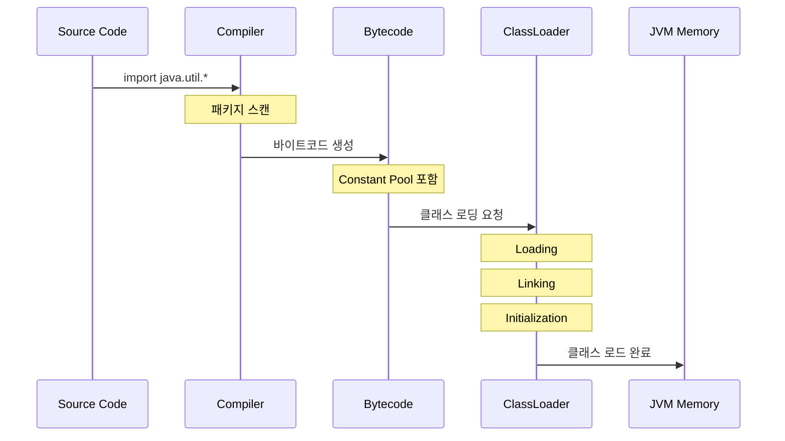
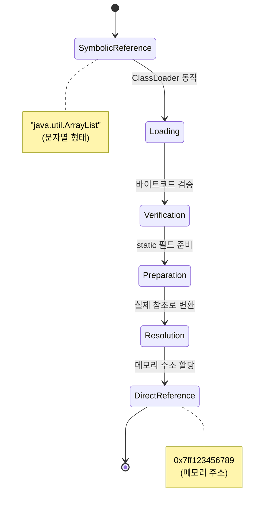
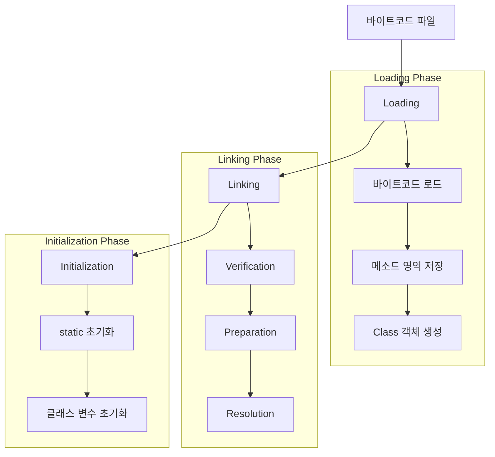

코딩테스트를 준비하면서 import 구문을 필요한 것 마다 직접 적다가 문득 와일드카드로 통으로 임포트하면 안되나? 하는 궁금증이 들었다. 특히 `java.util` 패키지는 거의 모든 문제에서 여러 클래스를 사용하게 되는데, 매번 하나씩 임포트하는 것이 실수를 유발할 수도 있고 시간에 쫒길 때는 임포트를 적는 시간마저도 아쉬울 때가 있었기 때문이다.

처음에 든 생각은 '통으로 임포트하면 성능에 안좋은 영향이 있지 않을까?' 하는 걱정이었다. 걱정은 결국 우려였다, 이유는 다음의 와일드카드 임포트의 처리 단계를 살펴보면 알 수 있다.

1. 컴파일 단계 (심볼릭 레퍼런스가 Constant Pool에 저장되고 실제 메모리 위치는 아직 알 수 없는 상태)
    1. 컴파일러가 와일드카드 임포트 구문을 처리한다.
    2. 해당 패키지의 클래스 목록을 확인한다.
    3. 실제 사용된 클래스만을 Constant Pool에 기록한다.
    4. 심볼릭 레퍼런스 형태로 바이트 코드에 포함한다.
2. 클래스로더 단계
    1. Loading
        + 바이트코드를 JVM의 메서드 영역에 로드
        + 해당 클래스의 Class 객체 생성
    2. Linking
        1. Verification : 바이트코드 유효성을 검증
        2. Preparation : static 필드 공간 할당
        3. Resolution : Constant Pool[^1]의 심볼릭 레퍼런스[^2]를 실제 메모리 참조로 변환
            + 이 단계에서 심볼릭 레퍼런스가 실제 메모리 참조로 변환되고 클래스 로딩 및 검증을 수행한다.
    3. Initialization
        + 클래스 변수 초기화 및 정적 초기화 블록 실행

이 단계를 통해 알 수 있는 주요 특징은 다음과 같다.
1. 와일드카드 임포트는 컴파일 시점에 처리가 완료된다.
2. 클래스로더는 Constant Pool의 참조만을 사용한다.
3. Lazy Loading 원칙에 따라 실제 사용 시점에 로드된다.
4. 미사용 클래스는 메모리에 로드되지 않는다.

결과적으로 **와일드카드 임포트는 런타임 성능에 영향을 미치지 않는다.**

## 시각화 자료
### 전체 프로세스 개요

### 심볼릭 레퍼런스 변환 과정

### 클래스 로더 동작 단계

[^1]: 클래스 파일 내의 주요 데이터 구조, 클래스에서 사용하는 상수 및 참조 정보를 포함하는 테이블. 문자열 리터럴, 클래스와 인터페이스 이름, 필드 참조, 메서드 참조 정보를 포함한다.
[^2]: 실제 메모리 주소가 아닌 이름 기반의 논리적 참조. `Constant Pool`에 문자열 형태로 저장된다. e.g. `java.util.ArrayList`와 같은 완전한 클래스 이름