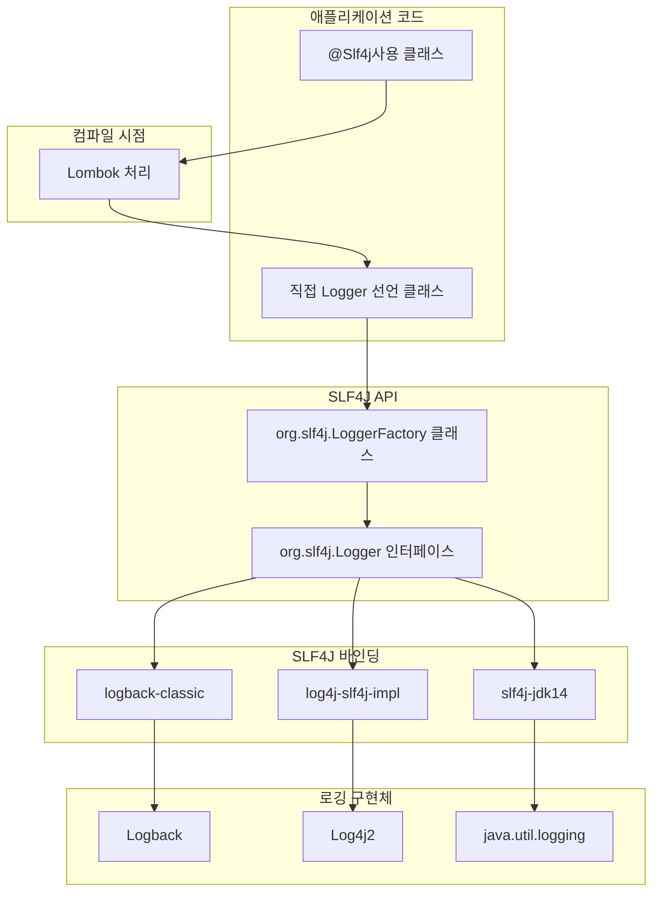

# SLF4J 로깅 아키텍처 이해하기

## 문제상황

오늘 프로젝트 코드를 살펴보다가 로깅 관련 코드에서 흥미로운 패턴을 발견했다. 일부 클래스에서는 `@Slf4j` 어노테이션을 사용하고, 다른 곳에서는 `private static final Logger log = LoggerFactory.getLogger(클래스명.class)` 형태로 직접 선언하고 있었다.

더 살펴보니 `LoggerFactory` 클래스도 SLF4J 패키지에 속해 있는 것을 확인했다. 이로 인해 두 방식의 차이점이 무엇인지, 그리고 만약 로깅 구현체를 변경한다면 이런 코드들도 수정해야 하는지 궁금증이 생겼다. 특히 `@Slf4j`와 `LoggerFactory`의 관계, 그리고 SLF4J가 실제 로깅 구현체와 어떻게 상호작용하는지 더 깊이 이해하고 싶었다.

## 해결방안

SLF4J(Simple Logging Facade for Java)의 아키텍처를 제대로 이해하면 이런 혼란을 해결할 수 있다. SLF4J는 로깅을 위한 **추상화 레이어**로, 실제 로깅 구현체(Logback, Log4j2 등)와 애플리케이션 코드 사이의 **중간자** 역할을 한다.

세 가지 핵심 사항을 발견했다:

1. `@Slf4j`와 `LoggerFactory.getLogger()` 방식은 기능적으로 동일하다
2. 두 방식 모두 SLF4J API를 사용하므로 구현체 변경 시 코드 수정이 필요 없다
3. 구현체 변경은 의존성과 설정 파일만 수정하면 된다

## 동작원리

SLF4J가 어떻게 작동하는지 단계별로 살펴봤다:

1. **선언 방식**:
    - Lombok `@Slf4j` 방식: 컴파일 시점에 자동으로 Logger 필드 생성
    - 직접 선언 방식: 개발자가 직접 필드 정의
2. **런타임 동작**:
    - 애플리케이션 시작 시 SLF4J는 클래스패스에서 바인딩(연결 모듈)을 찾는다
    - 발견된 바인딩을 통해 실제 구현체와 연결된다
    - 로그 메서드 호출 시 SLF4J는 이를 실제 구현체로 전달한다
3. **구현체 결정 과정**:

    ```
    애플리케이션 코드 → SLF4J API → SLF4J 바인딩 → 실제 로깅 구현체
    ```


이 구조를 더 명확히 이해하기 위해 다이어그램을 그려봤다:



## 활용예시

### 1. Logger 선언

두 가지 방법 모두 동일한 기능을 제공한다:

```java
// 방법 1: Lombok 사용
@Slf4j
public class UserService {
    public void doSomething() {
        log.info("작업을 수행합니다");
    }
}

// 방법 2: 직접 선언
public class ProductService {
    private static final Logger log = LoggerFactory.getLogger(ProductService.class);
    
    public void doSomething() {
        log.info("작업을 수행합니다");
    }
}
```

### 2. 로깅 구현체 변경 (Logback → Log4j2)

의존성만 교체하면 된다:

```xml
<!-- 변경 전: Logback 사용 -->
<dependency>
  <groupId>ch.qos.logback</groupId>
  <artifactId>logback-classic</artifactId>
  <version>1.2.11</version>
</dependency>

<!-- 변경 후: Log4j2 사용 -->
<dependency>
  <groupId>org.apache.logging.log4j</groupId>
  <artifactId>log4j-core</artifactId>
  <version>2.17.2</version>
</dependency>
<dependency>
  <groupId>org.apache.logging.log4j</groupId>
  <artifactId>log4j-slf4j-impl</artifactId>
  <version>2.17.2</version>
</dependency>
```

그리고 설정 파일만 변경:

- logback.xml → log4j2.xml

**코드는 전혀 변경할 필요가 없다!**

## 주의사항

1. **의존성 충돌**: 여러 SLF4J 바인딩이 클래스패스에 있으면 예상치 못한 동작이 발생할 수 있다.

2. **로거 이름 중요성**: `LoggerFactory.getLogger()`에 전달하는 클래스가 로그 식별에 중요하다. 잘못된 클래스를 전달하면 로그 분석이 어려워진다.

3. **static final 권장**: Logger 인스턴스는 항상 `private static final`로 선언하는 것이 메모리 효율성과 스레드 안전성 측면에서 좋다.

4. **바인딩 누락**: SLF4J API만 있고 바인딩이 없으면 "SLF4J: Failed to load class" 경고가 발생하고 로그가 출력되지 않는다.


## 결론

이번 조사를 통해 SLF4J의 핵심 가치를 이해하게 되었다. SLF4J는 로깅 코드와 실제 로깅 구현을 완전히 분리함으로써, **코드 변경 없이** 로깅 시스템을 교체할 수 있는 유연성을 제공한다.

`@Slf4j`나 직접 Logger를 선언하는 방식은 단지 개발자의 선호도나 프로젝트에서 Lombok 사용 여부에 따른 차이일 뿐, 둘 다 SLF4J API를 사용하므로 구현체 교체에 영향을 주지 않는다.

추가적으로, 로그를 효과적으로 사용하려면 로깅 레벨(DEBUG, INFO, WARN, ERROR)을 적절히 활용하고, 상황에 맞는 유용한 정보를 로그에 포함시키는 것이 중요하다는 점도 명심해야겠다.